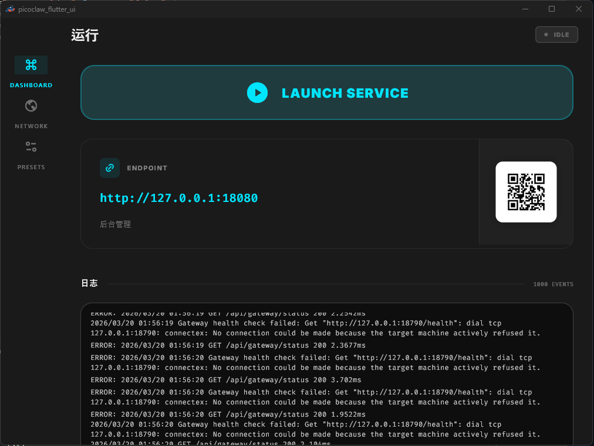
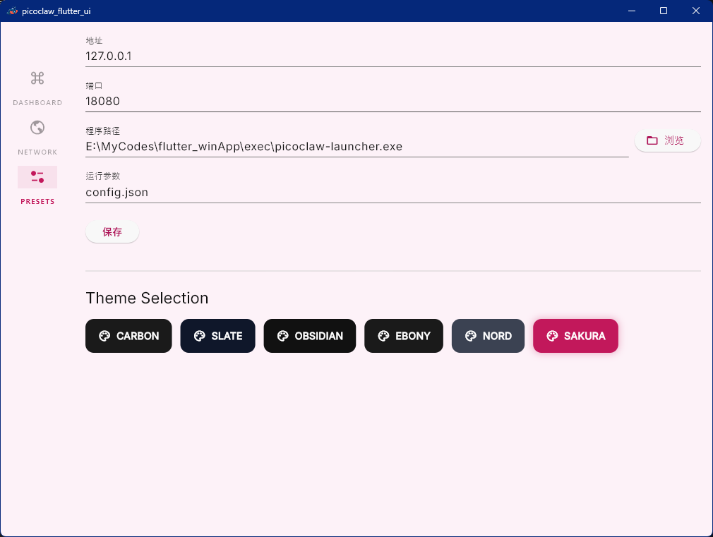
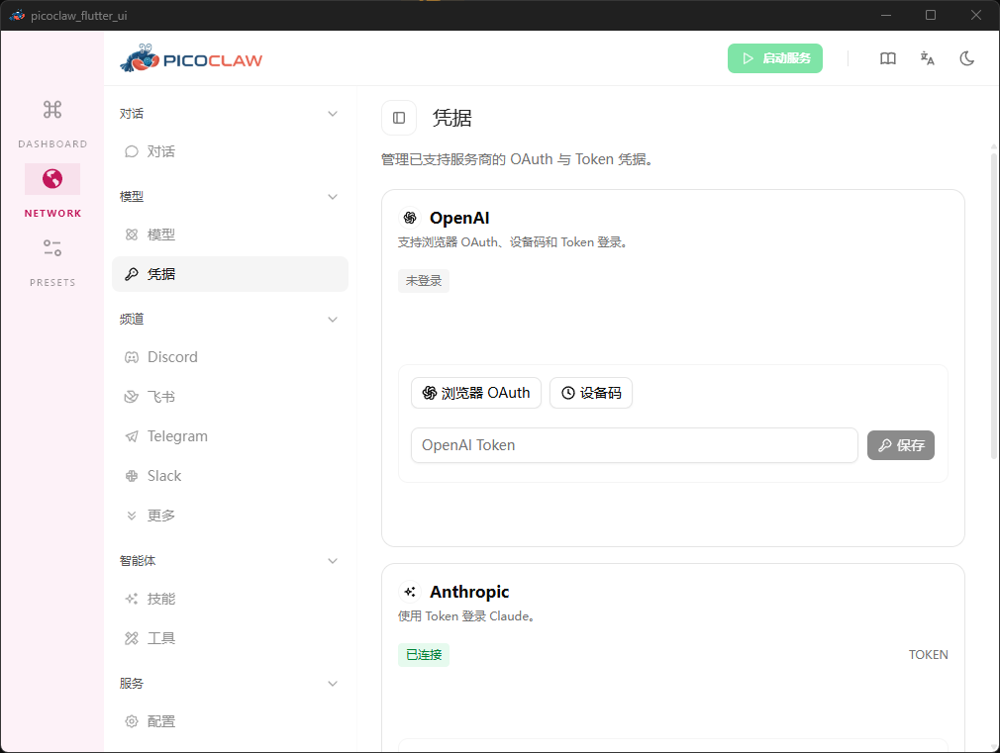
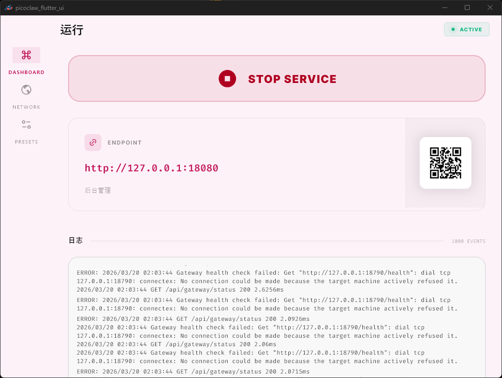
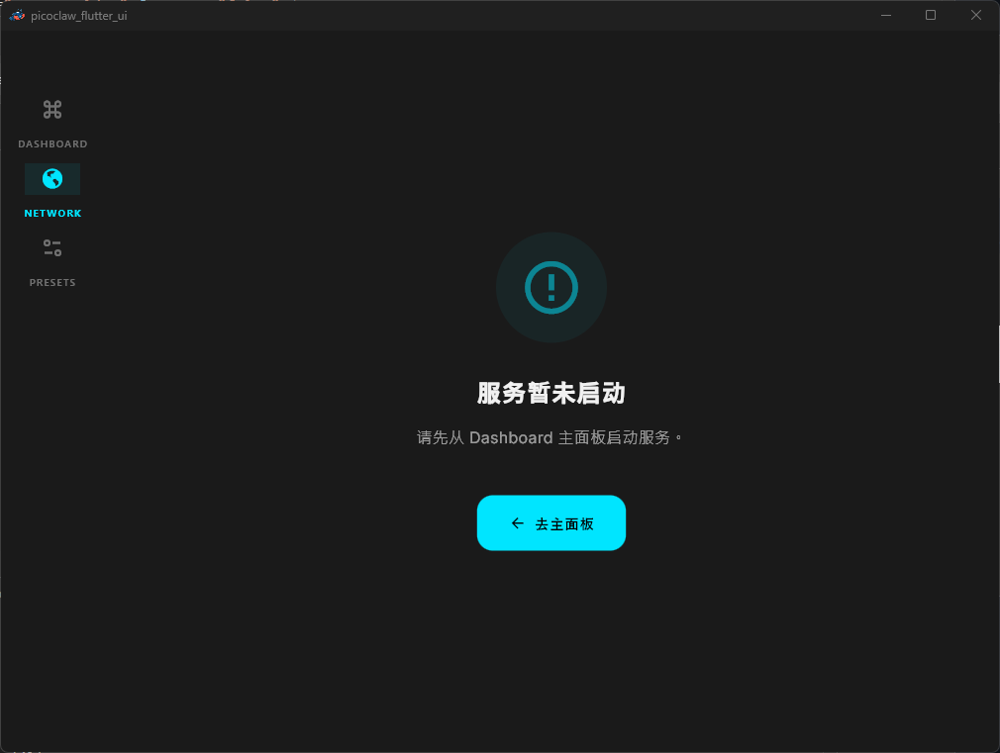
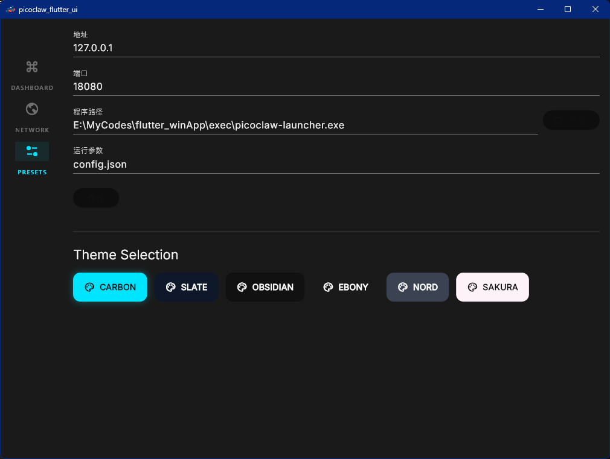

# PicoClaw Flutter UI

A modern cross-platform UI client for managing the `picoclaw` service. Designed for clarity, accessibility, and high contrast.

## ✨ Key Features

- **Minimalist Dashboard**: Clean interface with high-impact typography.
- **Accessible Controls**: Large action buttons optimized for Desktop and Mobile/TV usage.
- **Multiple Color Themes**: Includes 6 professional palettes (Carbon, Slate, Obsidian, Ebony, Nord, and SAKURA).
- **Log Monitoring**: Real-time log display with history management.
- **WebView Integration**: Embedded web management interface with status-aware guidance.
- **Desktop Ready**: Windows tray support, single-instance enforcement, and port conflict resolution.

## 📸 Screenshots

### Dashboard
| Idle Status | Running with SAKURA Theme |
| :---: | :---: |
|  |  |

### Network & Management
| Service Not Started Guide | Embedded Web UI (Sakura) |
| :---: | :---: |
|  |  |

### Configuration & Themes
| Midnight (Carbon) Selection | Sakura Theme Selection |
| :---: | :---: |
|  |  |

## 🚀 Getting Started

1. **Pre-requisites**: Ensure you have the `picoclaw` binary executable.
2. **Download**: Get the latest release from the [Releases](https://github.com/sky5454/picoclaw_fultter_ui/releases) page.
3. **Configure**: Go to the **PRESETS** tab to set your binary path and port.
4. **Launch**: Press the **LAUNCH SERVICE** button on the dashboard.

## 🛠️ Development

Building the project requires Flutter SDK:

```bash
flutter pub get
flutter run -d windows
```

For more details, see [docs/BUILD_GUIDE.md](docs/BUILD_GUIDE.md).

## 🔧 Local build & packaging helper

We've added a cross-platform Dart helper `tools/fetch_core_local.dart` to orchestrate three common steps:

- build the Flutter app for a target platform
- download the matching native `picoclaw` core binary from GitHub Releases
- install the binary into `app/bin/` (and optionally into platform build outputs) and run a packaging command

This script can be used in two main ways.

- One-step (build → fetch → install → optional pack):

	```bash
	# Example: build Android release AAB and APK, fetch core, install into build outputs
	flutter pub run tools/fetch_core_local.dart \
		--repo sipeed/picoclaw \
		--tag latest \
		--out-dir app/bin \
		--platform android \
		--arch arm64 \
		--build-mode release \
		--install-to-build
	```

	Notes:
	- Use `--platform` and `--arch` to explicitly select the target asset. When `--platform` is provided, `--arch` is required.
	- In CI you can pass the GitHub token as `--github-token $GITHUB_TOKEN` (or omit the option and set the `GITHUB_TOKEN` env var).
	- Add `--pack-cmd "your-pack-command"` to run a packager (e.g., NSIS, codesign) after installing.

- Two-step (fetch core, then run/debug locally):

	```bash
	# Download core and install to app/bin (no packaging)
	flutter pub run tools/fetch_core_local.dart \
		--repo sipeed/picoclaw \
		--tag latest \
		--out-dir app/bin \
		--platform windows \
		--arch x86_64 \
		--build-mode debug
    # or default download host arch and copy to default app/bin 
    dart run tools/fetch_core_local.dart 

	# Then run/debug with flutter (the app will look for the binary in app/bin)
	flutter run -d windows
	```

	Use `--dry-run` with the script to see planned steps without executing them.

Troubleshooting:
- If `--github-token` is passed without a value (for example when an empty env var is expanded), the script will fallback to the `GITHUB_TOKEN` environment variable if present. Prefer passing the token as `--github-token=$GITHUB_TOKEN` (no space) or set the env var.
- For Android builds, the script will skip downloading desktop/native executables if your project supplies JNI libs under `android/app/src/main/jniLibs/` — in that case the script writes `version.txt` with `android-jni-supplied` and exits.

See `tools/fetch_core_local.dart --help` for full option list.

## 📄 License

MIT License. See [LICENSE](LICENSE) for details.

